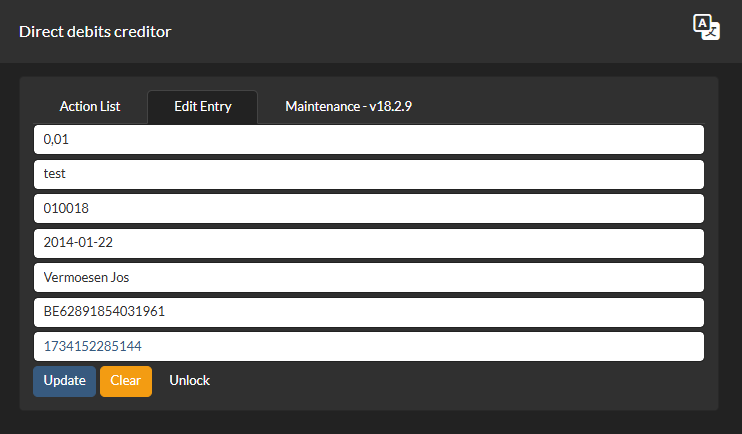

# Creditors Direct Debit - Domiciliëringen Schuldeiser

## Getting started for users



You can use directly on [demo site](https://cdd.vsoft.be)
Your data is stored as json files inside the localStorage of the browser you are using. With jsZip you can backup as zip file and/or transfert your data to other browsers and/or other computers

## Development Tools used for this app on march 2023

- [NodeJS](https://nodejs.org/)
- [Visual Studio Code](https://code.visualstudio.com/)
- [Angular CLI(v17)](https://www.npmjs.com/package/@angular/cli): `npm i -g @angular/cli@17`

## Getting started for developers

- [Install NodeJS](https://nodejs.org/). Hint: eventually install and use [nvm](https://medium.com/@Joachim8675309/installing-node-js-with-nvm-4dc469c977d9) for easy installing and/or switching between node versions
- Clone this repository: `git clone https://github.com/JosVermoesen/ngb-cdd.git`.
- Run `npm install` inside the project root.
- Run `ng serve` in a terminal from the project root.
- If scripts are disabled, open Powershell as administrator and run `Set-ExecutionPolicy -ExecutionPolicy RemoteSigned -Scope CurrentUser` first!
- Profit. :tada:

## NPM packages used for this app

- [bootstrap(v5.2.3)](https://www.npmjs.com/package/bootstrap): `npm i bootstrap@5`
- [ngx-bootstrap](https://www.npmjs.com/package/ngx-bootstrap): `npm i ngx-bootstrap@11` (or greater)
- [file-saver](https://www.npmjs.com/package/file-saver): `npm i file-saver`
- [@types/file-saver](https://www.npmjs.com/package/@types/file-saver): `npm i @types/file-saver`
- [jszip](https://www.npmjs.com/package/jszip): `npm i jszip`
- [date-fns](https://www.npmjs.com/package/date-fns): `npm i date-fns`
- [@ngx-translate/core](https://www.npmjs.com/package/@ngx-translate/core): `npm i @ngx-translate/core`
- [@ngx-translate/http-loader](https://www.npmjs.com/package/@ngx-translate/http-loader): `npm i @ngx-translate/http-loader`

- install all packages in one commandline: `npm i bootstrap ngx-bootstrap file-saver @types/file-saver jszip date-fns @ngx-translate/core @ngx-translate/http-loader`

## styles.css

For use of bootstrap, add into styles.css:

```bash
@import '~bootstrap/dist/css/bootstrap.min.css';
@import '~ngx-bootstrap//datepicker//bs-datepicker.css';
```

## Important1: tsconfig.json

Before building, add paths for jszip in compilerOptions AND set resolveJsonModule to 'true' :

```bash
"compilerOptions": {
    "paths": {
      "jszip": [
        "node_modules/jszip/dist/jszip.min.js"
      ]
    },
    "baseUrl": "./",
    ...
    "resolveJsonModule": true,
    ...
```

## warnings for file-saver

In angular.json, to avoid CommonJs warnings, add __allowedCommonJsDependencies__ in the options section for __file-saver, moment and jszip__:

```bash
"builder": "@angular-devkit/build-angular:browser",          
            ...
            "options": {
            "allowedCommonJsDependencies": [
              "file-saver",
              "moment",
              "jszip",              
            ],
            ...
```

## Updating to latest Angular 18

This app is now on Angular 18. Before starting an update, always commit first any valid open changes

update to latest Angular 18:
`ng update @angular/cli@18 @angular/core@18`

Follow the instructions eventualy to fixes and test good working app
